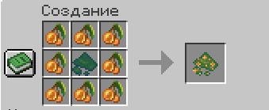

# 🌙 Cave Dreams

> ✨ Мод, что делает мшистые пещеры чуть живее

---

## 📖 Содержание

- [✨ Особенности](#-особенности)
- [📦 Установка](#-установка)
- [🍄 Предметы](#-предметы)
- [💤 Механика сна](#-механика-сна)
- [🐛 Мобы (скоро!)](#-мобы-скоро)
- [📸 Галерея](#-галерея)
- [🔮 Планы](#-планы)
- [🛠 Вклад в разработку](#-вклад-в-разработку)
- [📜 Лицензия](#-лицензия)

---

## ✨ Особенности

- **Два уникальных предмета**, влияющих на сон и состояние игрока.
- **Принудительный сон** прямо на земле, с изменением времени суток (даже днём!).
- **Разные последствия** после пробуждения — от кошмаров до прилива сил.
- **Будущий моб Засоня** — летающее нейтральное существо из мха, обитающее в пещерах.
- **Совместимость с одиночной игрой и серверами** (время меняется только в локальных мирах).

---

## 📦 Установка

1. Установи [Fabric Loader](https://fabricmc.net/use/installer/) для версии **1.20.1**.
2. Установи [Fabric API](https://modrinth.com/mod/fabric-api) (рекомендуется **0.92.2+1.20.1**).
3. Скачай последнюю версию мода **Cave Dreams** из раздела [Releases](https://github.com/IWoki/CaveDreamsMod/releases).
4. Помести скачанный `.jar` файл в папку `mods` твоей Minecraft.
5. Запускай игру и погружайся в дрёму!

---

## 🍄 Предметы

| 🌿 Предмет | 🆔 ID | 📝 Описание | ⚡ Эффект после пробуждения |
|-----------|-------|-------------|------------------------------|
| **Дикая пыль сновидений** | `cavedreams:untamed_lulladust` | Нестабильный споровый порошок, вызывающий беспокойный сон. Восстанавливает **2** ед. голода и **1** сытость. | Слепота (10 сек) + Медлительность II (20 сек) |
| **Чистая пыль сновидений** | `cavedreams:stabilized_lulladust` | Очищенная светящимися ягодами субстанция, дарующая приятный отдых. Восстанавливает **4** ед. голода и **8** сытости. | Скорость I (10 сек) + Сила I (20 сек) |

### 🔧 Крафт

**Стабилизированная пыль сновидений** создаётся в верстаке:

*Рецепт: 8 светящихся ягод + 1 Дикая пыль сновидений в центре.*

---

## 💤 Механика сна

- 🍽️ При поедании любого из предметов игрок **немедленно засыпает** прямо на земле.
- 🕒 В **одиночной игре** время суток сдвигается: днём — на ночь, ночью — на утро.
- 🌐 На **сервере** время остаётся неизменным, но сон и эффекты работают.
- ⏳ Длительность сна — **10 секунд** (200 тиков). После пробуждения накладываются соответствующие эффекты.
- 🔄 У предметов есть встроенный **кулдаун**, чтобы избежать спама.

---

## 🐛 Мобы (скоро!)

### 🧵 Засоня (Lullabite)

Летающее нейтральное создание, сотканное из мха и спор. Обитает во **мшистых пещерах**.  

**Особенности поведения (в разработке):**
- 🏃 Одиночная особь убегает от игрока.
- 👥 Группа от 3 особей перестаёт бояться и приближается с любопытством.
- 💀 Длительное нахождение рядом вызывает негативные эффекты у игрока.
- 🎲 При убийстве дропает **Дикую Пыль сновидений** (20% шанс).
- 💕 Могут размножаться после того, как игрок поспит рядом с ними.

> *Модель, текстуры и звуки будут добавлены в следующих обновлениях.*

---

## 📸 Галерея

**🔨 Крафт:**

*Отчистка дикой пыли с помощью ягод.*

---

**😴 Процесс сна:**

*Съедая любую пыль, игрок ложится спать.*

---

**🐛 Моб Засоня:**

*`[ WIP ]`*  
*Появится позже!*

---

## 🔮 Планы

- [ ] Добавление моба **Засони** с уникальной моделью и механикой.
- [ ] Новые звуки и анимации для моба.
- [ ] Спавн во мшистых пещерах.
- [ ] Достижения, связанные со сном и взаимодействием с мобами.

---

## 🛠 Вклад в разработку

Буду рад любым предложениям и баг-репортам!  
Репозиторий: [https://github.com/IWoki/CaveDreamsMod](https://github.com/IWoki/CaveDreamsMod)

- 🔧 Основная ветка разработки: `develop`
- 🚀 Стабильные релизы: `main`

---

## 📜 Лицензия

Этот проект распространяется под лицензией **MIT**.  
Подробности в файле [LICENSE](LICENSE).

# 🌙 Cave Dreams (English)

> ✨ Making lush caves feel a little more alive

---

## 📖 Table of Contents

- [✨ Features](#-features)
- [📦 Installation](#-installation)
- [🍄 Items](#-items)
- [💤 Sleep Mechanics](#-sleep-mechanics)
- [🐛 Mobs (Coming Soon!)](#-mobs-coming-soon)
- [📸 Gallery](#-gallery)
- [🔮 Roadmap](#-roadmap)
- [🛠 Contributing](#-contributing)
- [📜 License](#-license-1)

---

## ✨ Features

- **Two unique items** that affect sleep and player status.
- **Forced sleep** on the bare ground with a time shift (even during the day!).
- **Different consequences** after waking — from nightmares to a surge of power.
- **Upcoming Lullabite mob** — a flying neutral creature made of moss, dwelling in caves.
- **Compatible with singleplayer and multiplayer** (time changes only in local worlds).

---

## 📦 Installation

1. Install [Fabric Loader](https://fabricmc.net/use/installer/) for version **1.20.1**.
2. Install [Fabric API](https://modrinth.com/mod/fabric-api) (recommended **0.92.2+1.20.1**).
3. Download the latest **Cave Dreams** mod from [Releases](https://github.com/IWoki/CaveDreamsMod/releases).
4. Place the `.jar` file into your `mods` folder.
5. Launch the game and drift into dreams!

---

## 🍄 Items

| 🌿 Item | 🆔 ID | 📝 Description | ⚡ Post‑sleep effects |
|--------|-------|---------------|-----------------------|
| **Untamed Lulladust** | `cavedreams:untamed_lulladust` | Unstable spore powder that induces restless sleep. Restores **2** hunger & **1** saturation. | Blindness (10s) + Slowness II (20s) |
| **Stabilized Lulladust** | `cavedreams:stabilized_lulladust` | Refined with glow berries, grants peaceful rest. Restores **4** hunger & **8** saturation. | Speed I (10s) + Strength I (20s) |

### 🔧 Crafting

**Stabilized Lulladust** is crafted in a crafting table:

*Recipe: 8 glow berries + 1 Untamed Lulladust in the center.*

---

## 💤 Sleep Mechanics

- 🍽️ Eating either item makes the player **immediately fall asleep** on the spot.
- 🕒 In **singleplayer**, time skips: daytime → night, nighttime → morning.
- 🌐 On a **dedicated server**, time stays unchanged, but the sleep and effects still occur.
- ⏳ Sleep lasts **10 seconds** (200 ticks). After waking, the corresponding effects are applied.
- 🔄 The items have a built‑in cooldown to prevent spam.

---

## 🐛 Mobs (Coming Soon!)

### 🧵 Lullabite

A floating neutral entity woven from moss and spores, spawning in **lush caves**.  

**Planned behavior:**
- 🏃 A lone Lullabite flees from the player.
- 👥 A group of 3+ loses fear and approaches with curiosity.
- 💀 Prolonged proximity applies negative effects to the player.
- 🎲 Drops **Untamed Lulladust** on death (20% chance).
- 💕 Can breed after the player sleeps near them.

> *Model, textures and sounds will be added in future updates.*

---

## 📸 Gallery

**🔨 Crafting:**

*Purifying the wild dust with glow berries.*

---

**😴 Sleeping process:**

*Upon eating either dust, the player falls asleep.*

---

**🐛 Lullabite Mob:**

*`[ WIP ]`*  
*Coming later!*

---

## 🔮 Roadmap

- [ ] Add the **Lullabite** mob with a custom model and mechanics.
- [ ] New sounds and animations for the mob.
- [ ] Natural spawning in lush caves.
- [ ] Advancements related to sleep and mob interaction.

---

## 🛠 Contributing

Any suggestions or bug reports are welcome!  
Repository: [https://github.com/IWoki/CaveDreamsMod](https://github.com/IWoki/CaveDreamsMod)

- 🔧 Development branch: `develop`
- 🚀 Stable releases: `main`

---

## 📜 License

This project is licensed under the **MIT** License.  
See [LICENSE](LICENSE) for details.

---

